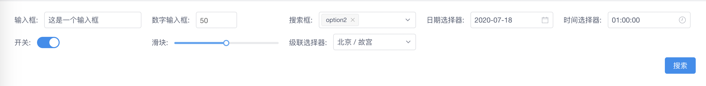
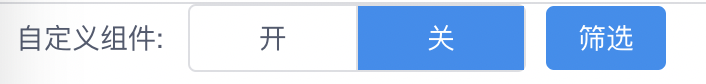

# vue-filter-box

  

## 介绍

vue-filter-box是一款根据JSON对象自动构建的vue筛选框组件, 基于[view-design](<https://www.iviewui.com/>), 支持多种常见筛选组件: 输入框, 下拉框, 时间选择器, 级联选择器等多种组件, 以及根据特定规则编写的自定义组件

## 项目引入要求

1. 安装`vue`
2. 项目[全局引入](https://www.iviewui.com/docs/guide/start#YR_ViewUI)`view-design`, 或是[按需引入](https://www.iviewui.com/docs/guide/start#AXYY)所需组件

## 安装

```
# use npm
npm i vue-filter-box
# or yarn
yarn add vue-filter-box
```

## 使用

### 全局注册:

```javascript
import Vue from 'vue'
import VueFilterBox from 'vue-filter-box'
Vue.use(VueFilterBox)
```

### 单独引入组件:

```vue
<template>
	<vue-filter-box></vue-filter-box>
</template>
<script>
    import {VueFilterBox} from 'vue-filter-box'
    export default {
        components: {
            VueFilterBox
        }
    }
</script>
```

## 示例

### 代码:

```vue
<template>
    <div class="form-wrap">
      <vue-filter-box ref="filterBox" :model="model" :value="filterValue" button-hide @on-search="onSearch">
        <div class="footer" slot="footer"><Button type="primary" @click="searchWrap">搜索</Button></div>
      </vue-filter-box>
    </div>
</template>

<style lang="less" scoped>
  .form-wrap {
    padding: 20px;

    .footer {
      display: flex;
      justify-content: flex-end;
      width: 100%;
    }
  }
</style>

<script>
  import {VueFilterBox} from 'vue-filter-box'
  import {Button} from 'view-design'
  export default {
    name: 'App',
    components: {
      VueFilterBox,
      Button
    },
    data() {
      return {
          model: {
            input: {
              component: 'Input',
              title: '输入框',
              width: '20%',
              on: {
                'on-change': event => {
                  console.log(`输入的值为: ${event.target.value}`)
                }
              }
            },
            inputNumber: {
              component: 'InputNumber',
              title: '数字输入框',
              width: '20%'
            },
            select: {
              component: 'Select',
              title: '搜索框',
              width: '20%',
              options: [
                {label: 'option1', value: 0},
                {label: 'option2', value: 1}
              ],
              prop: {
                multiple: true
              }
            },
            date: {
              component: 'DatePicker',
              title: '日期选择器',
              width: '20%'
            },
            time: {
              component: 'TimePicker',
              title: '时间选择器',
              width: '20%'
            },
            iSwitch: {
              component: 'i-switch',
              title: '开关',
              width: '20%'
            },
            slider: {
              component: 'Slider',
              title: '滑块',
              width: '20%'
            },
            cascader: {
              component: 'Cascader',
              title: '级联选择器',
              width: '20%',
              prop: {
                data: [
                  {
                    value: 'beijing',
                    label: '北京',
                    children: [
                      {value: 'gugong', label: '故宫'}
                    ]
                  }
                ]
              }
            }
          },
          filterValue: {
            input: '这是一个输入框',
            inputNumber: 50,
            select: [1],
            date: new Date(),
            time: '01:00:00',
            iSwitch: true,
            cascader: ['beijing', 'gugong'],
            slider: 50
          }
      }
    },
    methods: {
      searchWrap() {
        this.$refs.filterBox.onSearch()
      },
      onSearch(value) {
        console.log(value)
      }
    }
  }
</script>
```

### 展示为:



## API文档

### Props

| 属性        | 说明                                        | 类型    | 默认值  |
| ----------- | ------------------------------------------- | ------- | ------- |
| model       | 筛选项构建模型, 详细结构查看[Model](#Model) | Object  | {}      |
| value       | 绑定的值, 可使用v-model双向绑定             | Object  | {}      |
| size        | 组件大小, 可选值为small, default, large     | String  | default |
| loading     | 加载状态                                    | Boolean | false   |
| button-hide | 是否隐藏默认按钮                            | Boolean | false   |

### Events

| 事件名    | 说明               | 返回值 |
| --------- | ------------------ | ------ |
| on-search | 点击搜索按钮时触发 | value  |

### slots

| 名称   | 说明                                           |
| ------ | ---------------------------------------------- |
| footer | 筛选项底部, 跟在最后一个筛选项或是搜索按钮后面 |

### Model

**props中的model结构**

| 属性      | 说明                                                         | 类型             | 示例                        |
| --------- | ------------------------------------------------------------ | ---------------- | --------------------------- |
| component | 筛选项组件, 支持Input, Select等, 具体查看[Components](#Components) | String/Component | 'Input'                     |
| title     | 筛选项标题                                                   | String           | '这是一个标题'              |
| width     | 筛选项宽度, 支持px和百分比                                   | String           | '200px' 或者 '20%'          |
| options   | 下拉选项, 仅当component为Select时有效, 具体格式请查看[Options](#Options) | Array            | [{label: '文本', value: 1}] |
| props     | 筛选项组件props, 具体请查看[view-design](<https://www.iviewui.com/>)中组件对应的props | Object           | {type: 'textarea'}          |
| on        | 筛选项组件的methods, 具体请查看[view-design](https://www.iviewui.com/)中组件支持的methods |                  | {'on-change': () => {}}     |

### Options

**model props中的options结构**

| 属性  | 说明             | 类型          |
| ----- | ---------------- | ------------- |
| label | 选项显示文本内容 | String        |
| value | 选项值           | String/Number |

### Components

**vue-filter-box支持的组件**

| 组件名称    | 说明                    |
| ----------- | ----------------------- |
| Input       | 输入框                  |
| InputNumber | 数字输入框              |
| Select      | 下拉框, 配合options使用 |
| DatePicker  | 日期选择器              |
| TimePicker  | 时间选择器              |
| i-switch    | 开关                    |
| Slider      | 可拖动的滑块            |
| Cascader    | 级联选择器              |

### 自定义组件

除了[Components中的组件, 还可进行使用自定义组件, 只要组件内部支持v-model进行数据绑定即可, 以下是自定义组件的例子:

```vue
// CustomComponent.vue
<template>
  <div class="wrap">
    <div
      :class="{
        'selected-block': option.value === _value,
        'block': true
      }"
      v-for="option of options"
      :key="option.value"
      @click="setStatus(option.value)">
      {{option.label}}
    </div>
  </div>
</template>

<style lang="less">
  @color: #dddee2;
  @backgroundColor: #2d8bf0;
  .wrap {
    display: flex;
    border: 1px solid @color;
    border-radius: 4px;

    .selected-block {
      color: #fff;
      background-color: @backgroundColor;
    }

    .block:first-child {
      border-left: none;
    }

    .block {
      display: flex;
      justify-content: center;
      flex-grow: 1;
      border-left: 1px solid @color;
      cursor: pointer;
    }
  }
</style>

<script>
    import {Button} from 'view-design'
    export default {
      name: 'CustomComponent',
      components: {
        Button
      },
      props: {
        value: Boolean
      },
      computed: {
        _value: {
          get() {
            return this.value
          },
          set(value) {
            this.$emit('input', value)
          }
        }
      },
      data() {
        return {
          options: [
            {label: '开', value: true},
            {label: '关', value: false}
          ]
        }
      },
      methods: {
        setStatus(status) {
          this._value = status;
        }
      }
    }
</script>
```

在vue-filter-box中引入:

```vue
// App.vue
<template>
    <div class="form-wrap">
      <vue-filter-box ref="filterBox" :model="model" :value="filterValue" @on-search="onSearch">
      </vue-filter-box>
    </div>
</template>

<script>
  import {VueFilterBox} from '@/components/index.js'
  import CustomComponent from './CustomComponent.vue'
  export default {
    name: 'App',
    components: {
      VueFilterBox
    },
    data() {
      return {
          model: {
            custom: {
              component: CustomComponent,
              title: '自定义组件',
              width: '20%'
            }
          },
          filterValue: {
            custom: false
          }
      }
    },
    methods: {
      onSearch(value) {
        console.log(value)
      }
    }
  }
</script>
```

展示:

