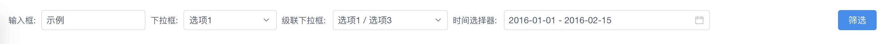

# vue-filter-box

  

## 介绍

vue-filter-box是一款根据JSON对象自动构建的vue筛选框组件, 基于[view-design](<https://www.iviewui.com/>)

## 安装

```
# use npm
npm i vue-filter-box
# or yarn
yarn add vue-filter-box
```

## 使用

**全局注册:**

```javascript
import Vue from 'vue'
import VueFilterBox from 'vue-filter-box'
Vue.use(VueFilterBox)
```

**单独引入组件:**

```vue
<template>
	<vue-filter-box></vue-filter-box>
</template>
<script>
    import {VueFilterBox} from 'vue-filter-box'
    export default {
        components: {
            VueFilterBox
        }
    }
</script>
```

## 示例

**代码:**

```vue
<template>
    <vue-filter-box :items="filterItems" :value="filterValue" @on-click="search"></vue-filter-box>
</template>
<script>
    import {VueFilterBox} from 'vue-filter-box'
    export default {
        name: 'Demo',
        components: {
            VueFilterBox
        },
        data() {
            return {
                filterValue: {
                    inputKey: '示例',
                    selectKey: 1,
                    cascaderKey: [1, 3],
                    datepickerKey: ['2016-01-01', '2016-02-15']
                },
                filterItems: [
                    {
                        title: '输入框',
                        key: 'inputKey',
                        type: 'input',
                        minWidth: '15%'
                    },
                    {
                        title: '下拉框',
                        key: 'selectKey',
                        type: 'select',
                        minWidth: '15%',
                        options: [
                            {
                                label: '选项1',
                                value: 1
                            },
                            {
                                label: '选项2',
                                value: 2
                            }
                        ]
                    },
                    {
                        title: '级联下拉框',
                        key: 'cascaderKey',
                        type: 'cascader',
                        minWidth: '15%',
                        options: [
                            {
                                label: '选项1',
                                value: 1,
                                children: [
                                    {
                                        label: '选项3',
                                        value: 3
                                    }
                                ]
                            },
                            {
                                label: '选项2',
                                value: 2
                            }
                        ]
                    },
                    {
                        title: '时间选择器',
                        key: 'datepickerKey',
                        type: 'datepicker',
                        minWidth: '30%',
                        extend: {
                            props: {
                              type: 'daterange'
                            }
                        }
                    }
                ]
            }
        },
        methods: {
            search(value) {}
        }
    }
</script>
```

**展示为:**



## API文档

**props:**

- items

  `array` 构建筛选项配置, 详细请看下文中的*item*

- value

  `object` 筛选项值

- size

  `string` 筛选项组件大小

  - default 默认
  - small
  - large

- loading

  `boolean` 加载状态

- confirm

  `object` 筛选按钮基本属性, 详细请看下文中的*confirm*

**event:**

- on-click

  点击事件, 返回值为当前筛选项值[Object]

**slot**

- footer 自定义底部

  注意: footer会导致confirm部分属性不生效, 因为设置footer就意味着失去默认的按钮, 相应的, on-click也会失效

**item**

构建筛选项配置数据对象, 是items中的一项

- title

  `string` 筛选项标题

- type

  `string` 筛选项类型

  | 值         | 说明       |
  | ---------- | ---------- |
  | input      | 输入框     |
  | select     | 下拉框     |
  | datepicker | 时间选择器 |
  | cascader   | 级联下拉框 |

- key

  `string` 键值

- width

  `string` 筛选项宽度; 例如`200px`, `20%`

- minWidth

  `string` 筛选项最小宽度, 当行宽小于`minWidth`时自动换行; 例如`200px`, `20%`

- extend

  `object` 拓展属性, 格式规则请看下文中的*extend*, 筛选组件的props以及event则查看[view-design](<https://www.iviewui.com/>)中对应组件介绍

  示例:

  ```javascript
  {
      title: '下拉框',
      type: 'select',
      key: 'selectKey',
      option: [
          {
              label: '示例1',
              value: 1
          }
      ],
      extend: {
          props: {
              size: 'small' // 修改下拉框组件的size, 具体请查看view-design官方文档
          },
          on: {
              'on-change': value => {} // 设置下拉框组件修改值回调函数, 具体请查看view-design官方文档
          }
      }
  }
  ```

- data

  `array` 下拉列表, 仅当`type`等于`select`, `cascader`时生效

  data中每个`option`格式

  - label

    `string` 下拉文本

  - value

    `string` 值

  - children

    `array` 子级列表, 格式和`data`一致, 仅当`type`等于`cascader`时生效

**confirm**

- title

  `string` 按钮文本

- type

  `string` 按钮类型

  - primary
  - default
  -  dashed
  - text
  - success
  - warning
  - error
  - info

- isNotFull

  `boolean` 是否占据该行剩余空间, 表现形式为: 按钮是否置于该行的末尾

- extend

  `object` 拓展属性, 详细请看下文的*extend*, 相应的props以及event则查看[view-design](<https://www.iviewui.com/>)中Button组件介绍

**extend**

`object` 拓展属性, 具体格式规则可查看[vue官方文档 - 渲染函数 & JSX - 深入数据对象](<https://cn.vuejs.org/v2/guide/render-function.html#%E6%B7%B1%E5%85%A5%E6%95%B0%E6%8D%AE%E5%AF%B9%E8%B1%A1>)

以下是官方文档中的格式:

```javascript
{
  // 与 `v-bind:class` 的 API 相同，
  // 接受一个字符串、对象或字符串和对象组成的数组
  'class': {
    foo: true,
    bar: false
  },
  // 与 `v-bind:style` 的 API 相同，
  // 接受一个字符串、对象，或对象组成的数组
  style: {
    color: 'red',
    fontSize: '14px'
  },
  // 普通的 HTML attribute
  attrs: {
    id: 'foo'
  },
  // 组件 prop
  props: {
    myProp: 'bar'
  },
  // DOM 属性
  domProps: {
    innerHTML: 'baz'
  },
  // 事件监听器在 `on` 属性内，
  // 但不再支持如 `v-on:keyup.enter` 这样的修饰器。
  // 需要在处理函数中手动检查 keyCode。
  on: {
    click: this.clickHandler
  },
  // 仅用于组件，用于监听原生事件，而不是组件内部使用
  // `vm.$emit` 触发的事件。
  nativeOn: {
    click: this.nativeClickHandler
  },
  // 自定义指令。注意，你无法对 `binding` 中的 `oldValue`
  // 赋值，因为 Vue 已经自动为你进行了同步。
  directives: [
    {
      name: 'my-custom-directive',
      value: '2',
      expression: '1 + 1',
      arg: 'foo',
      modifiers: {
        bar: true
      }
    }
  ],
  // 作用域插槽的格式为
  // { name: props => VNode | Array<VNode> }
  scopedSlots: {
    default: props => createElement('span', props.text)
  },
  // 如果组件是其它组件的子组件，需为插槽指定名称
  slot: 'name-of-slot',
  // 其它特殊顶层属性
  key: 'myKey',
  ref: 'myRef',
  // 如果你在渲染函数中给多个元素都应用了相同的 ref 名，
  // 那么 `$refs.myRef` 会变成一个数组。
  refInFor: true
}
```

